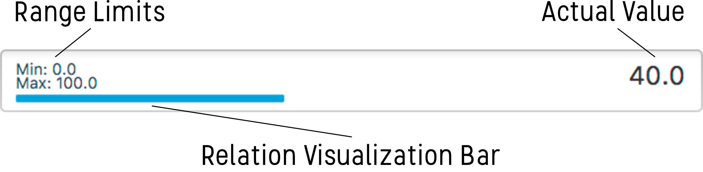

# Relation Number Field [](https://travis-ci.org/cansik/relation-number-field) [](https://codebeat.co/projects/github-com-cansik-relation-number-field)
Relation Number Field (RNF) is a custom control for java fx which shows the relation between the number and other values.

## Idea
The Relation Number Field is a basic user control which gives you as designer the possibility to visualise the relation between a number and the context.

## User Control
To show the relation between the **current value** and other interesting values like the **minimum** and **maximum** value, the text field contains a small colored bar, which visualises the relation.



## How To Use It
Here are some examples how to use the control.

```java
// basic example
RelationNumberField numberField = new RelationNumberField();
numberField.setValue(42.5);

// set range
numberField.setMinimum(0.0);
numberField.setMinimum(80.0);

// bind value
numberField.valueProperty().bindBidirectional(myNumber);

// set design
numberField.setBarFill(Color.web("#696969"));
numberField.setMinimumBarHeight(20.0);
numberField.setShowRange(false);
```

## About
A custom control by Alexander Wyss & Florian Bruggisser written for the module CUIE of the FHNW *2017*.